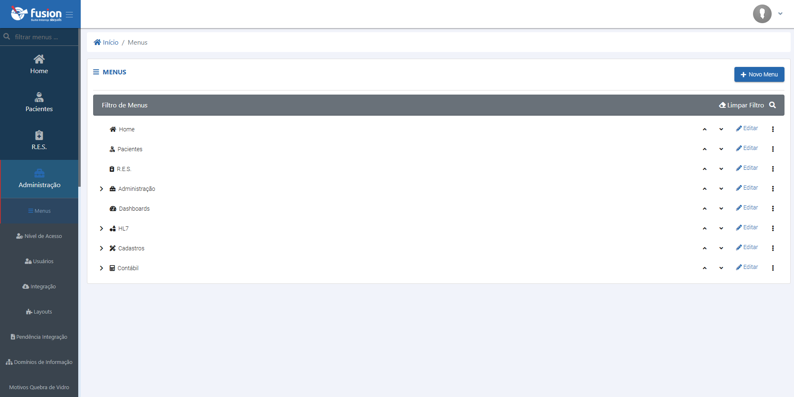
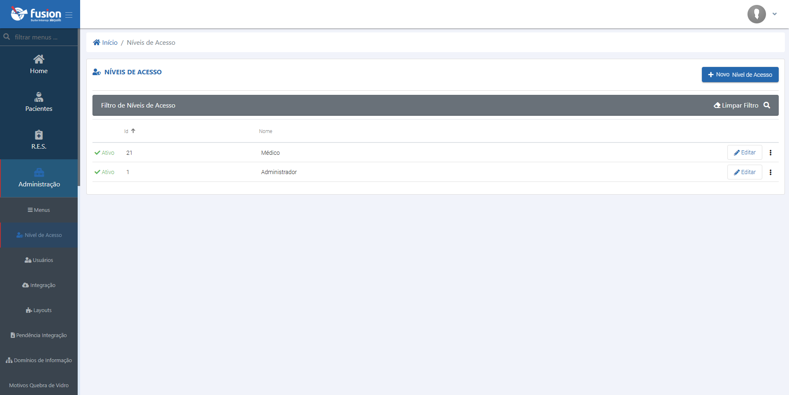
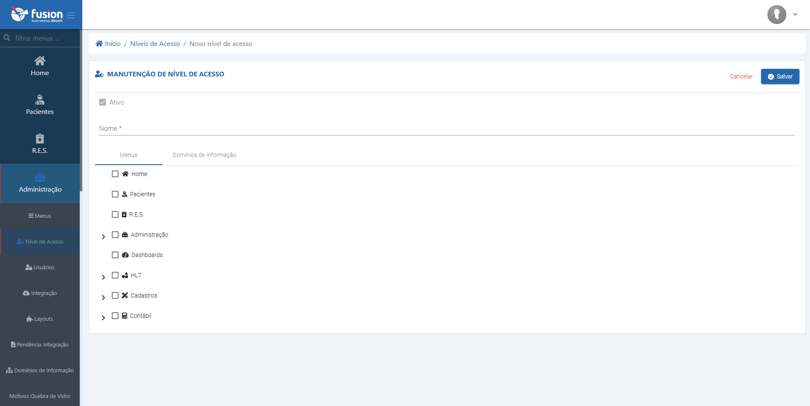
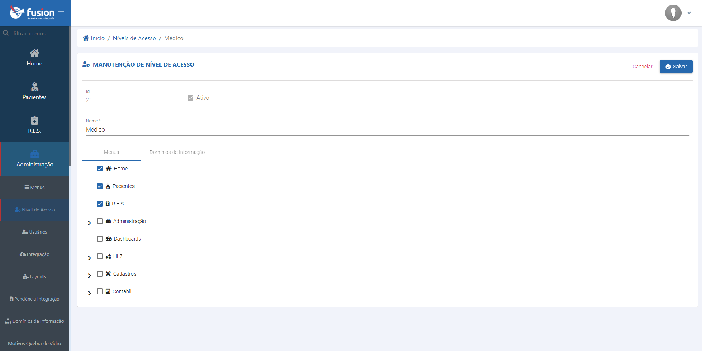
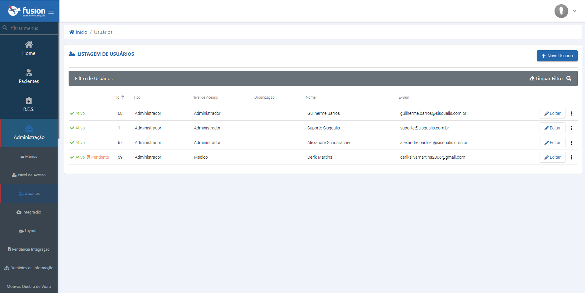
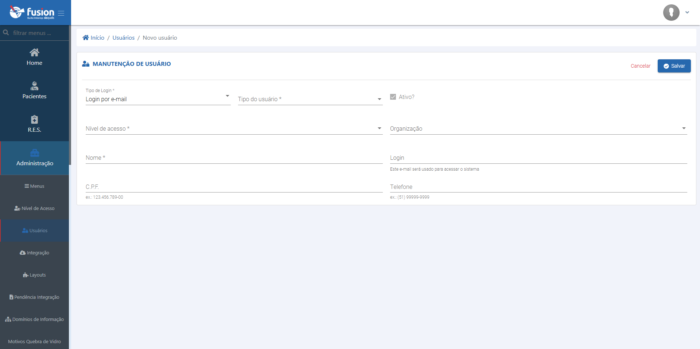
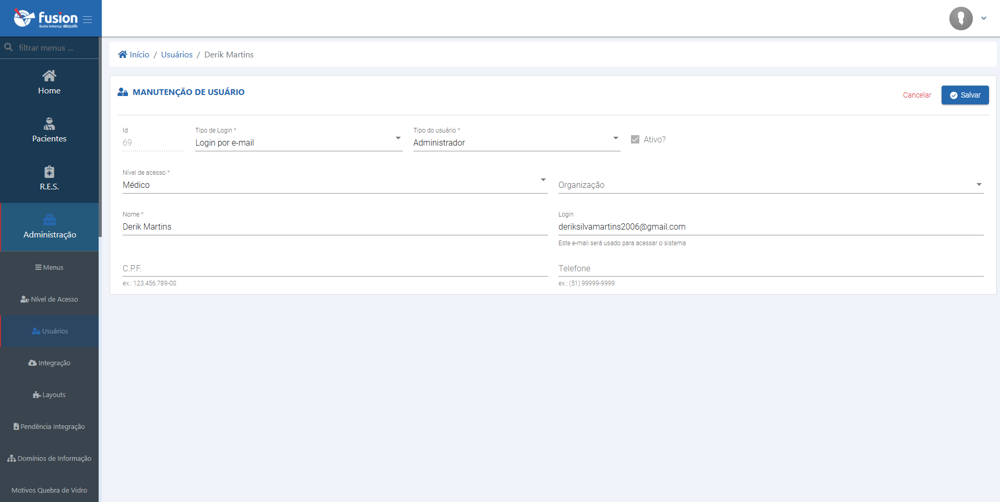

import Admonition from '@theme/Admonition';
import Tabs from '@theme/Tabs';
import TabItem from '@theme/TabItem';

# Gerenciamento de Acesso no Fusion

## Visão Geral

    

    <h2 style={{ marginTop: '0', color: '#fff', fontSize: '1.5em' }}>Como gerencio os Acessos?</h2>
        

            A seção de gerenciamento de acesso do Fusion é o centro de controle para personalizar e gerenciar as funcionalidades da plataforma. Esta área permite que administradores configurem o sistema de acordo com as necessidades específicas da instituição, garantindo segurança e eficiência operacional..
        

    

Através de uma interface intuitiva, é possível realizar configurações cruciais, tais como:

-   **Gestão de Usuários e Permissões:** Crie, modifique e gerencie contas de usuários, atribuindo níveis de acesso detalhados para cada funcionalidade do sistema.
-   **Configuração de Menus:** Personalize a navegação do sistema para otimizar a experiência do usuário.
-   **Definição de Perfis de Acesso:** Estabeleça diferentes perfis com permissões específicas, assegurando que cada usuário tenha acesso apenas às informações e ferramentas relevantes para seu trabalho.

Dominar estas configurações é fundamental para manter a integridade dos dados e a fluidez dos processos dentro da plataforma Fusion.

<Admonition type="info" title="Importância do Gerenciamento de Acesso">
Um gerenciamento de acesso eficaz é crucial para a segurança dos dados e para garantir que os usuários possam desempenhar suas funções de maneira produtiva, sem acesso a informações ou funcionalidades desnecessárias.
</Admonition>

## Configurações Detalhadas de Acesso

A seguir, detalhamos os principais componentes do gerenciamento de acesso no Fusion.

### 1. Gerenciamento do Menu do Sistema

O menu do Fusion é projetado para ser dinâmico e de fácil configuração, visando proporcionar uma excelente experiência de uso. Através da área de administração, é possível otimizar o Fusion para o fluxo de trabalho específico da sua instituição.

**Funcionalidades:**

-   **Reordenar Itens:** Ajuste a posição de cada item do menu utilizando as setas direcionais (para cima ou para baixo).
-   **Editar Itens:** Modifique informações como a ordem de exibição, se um item é um menu principal, se possui submenus (menu pai), entre outras configurações pertinentes.
-   **Excluir Itens:** Remova itens do menu através do ícone de opções (três pontos) localizado à direita de cada item.

### 2. Níveis de Acesso

Os níveis de acesso no Fusion definem os privilégios atribuídos aos usuários, simplificando a gestão de permissões.

**Funcionalidades:**

-   **Criar Novo Perfil:** Utilize o botão "Novo" para criar um perfil de acesso, preenchendo todas as informações e funcionalidades que este perfil poderá acessar.
-   **Editar Perfil Existente:** Modifique perfis já criados para ajustar ou complementar as funcionalidades permitidas.
-   **Ativar/Desativar Perfil:** Através do menu de opções (três pontos) à direita de cada perfil, é possível ativar ou desativar um perfil conforme a necessidade.

<Admonition type="tip" icon="🔑">
Recomenda-se a criação de perfis baseados nas funções dos usuários (ex: Administrador, Médico, Enfermeiro, Recepcionista) para uma gestão de permissões mais clara e organizada.
</Admonition>

<Tabs>

<TabItem value="listagem_niveis_acesso" label="Listagem de Níveis de Acesso" default>
    
</TabItem>

<TabItem value="criar_acesso" label="Criar Nível de Acesso">
    
</TabItem>

<TabItem value="editar_acesso" label="Editar Nível de Acesso">
    
</TabItem>

</Tabs>

### 3. Cadastro e Gerenciamento de Usuários

O Fusion permite um controle detalhado sobre o cadastro de usuários.

**Funcionalidades:**

-   **Criar Novo Usuário:** Clique no botão "Novo Usuário" e preencha as informações solicitadas.
-   **Editar Usuário:** Ajuste os dados de um usuário existente conforme necessário. O sistema registra as alterações.
-   **Campos Obrigatórios:**
    -   Tipo de usuário
    -   Tipo de login
    -   Nível de acesso (perfil)
-   **Campos Opcionais:** Demais informações podem ser preenchidas para complementar o cadastro.

<Tabs>

<TabItem value="listagem_user" label="Listagem de Usuários" default>
    
</TabItem>

<TabItem value="criar_user" label="Criar Usuário">
    
</TabItem>

<TabItem value="editar_user" label="Editar Usuário">
    
</TabItem>

</Tabs>

<Admonition type="caution" title="Segurança de Contas">
É fundamental orientar os usuários sobre a importância de senhas seguras e a não divulgação de suas credenciais de acesso. Considere a implementação de autenticação de múltiplos fatores (MFA) se disponível.
</Admonition>

---

Este guia abrange as funcionalidades essenciais para o gerenciamento de acesso no sistema Fusion. Para informações sobre outras áreas da administração, consulte a documentação específica.
