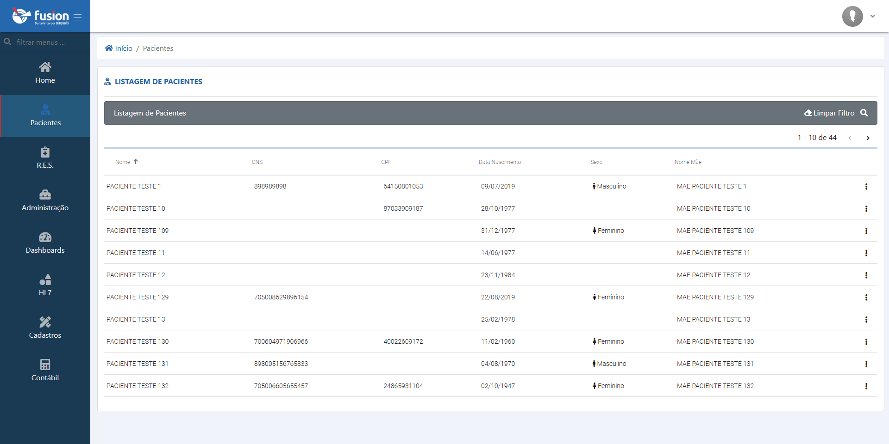
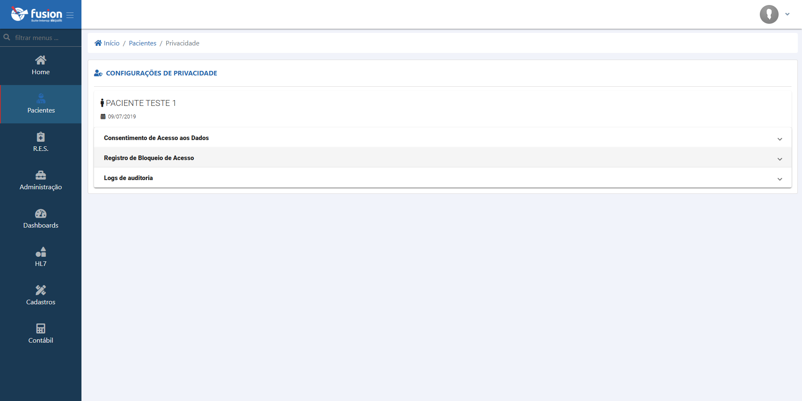
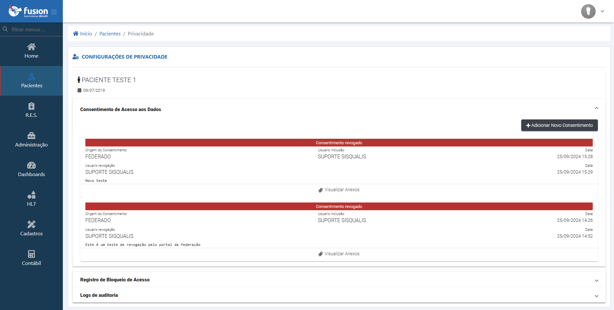
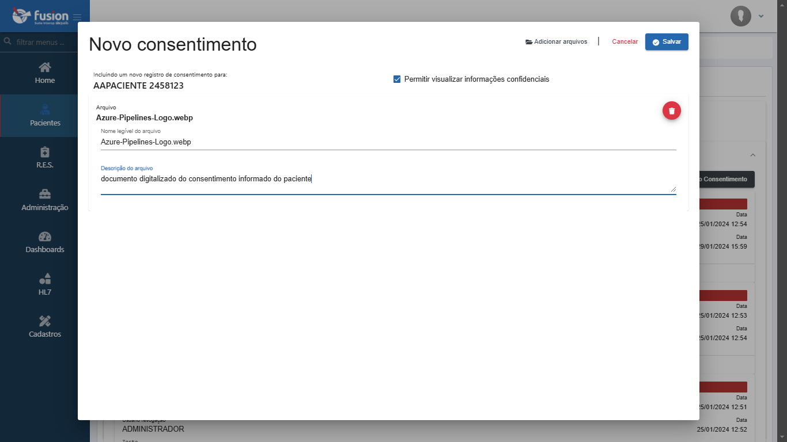
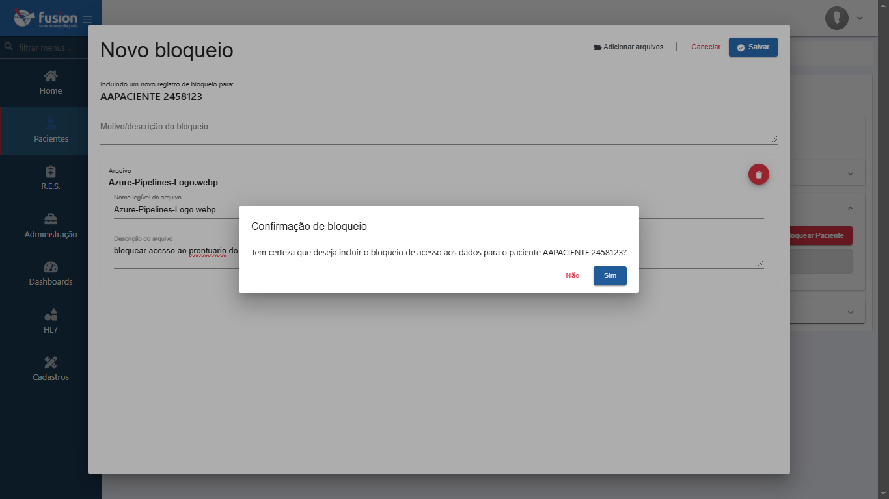
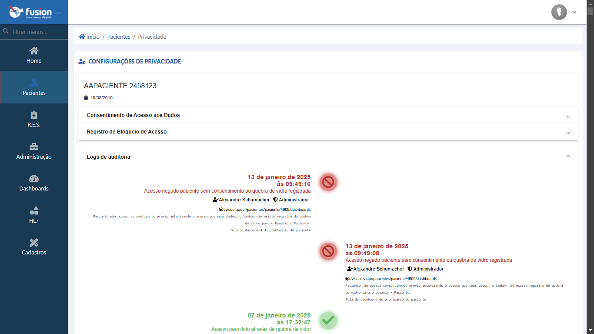

import Tabs from '@theme/Tabs';
import TabItem from '@theme/TabItem';

# Gestão de Pacientes no Fusion

Ao iniciar a utilização do Fusion, a tela inicial apresentada conduz diretamente à lista de pacientes. Esta seção é fundamental, pois nela são consolidadas diversas informações sobre cada indivíduo integrado à plataforma, em conformidade com as regras de negócio predefinidas. Para otimizar a localização de pacientes específicos, o sistema dispõe de uma robusta funcionalidade de filtros, permitindo buscas precisas com base nas principais informações cadastrais.

## Lista de Pacientes

A interface de listagem de pacientes exibe os resultados de buscas ou a totalidade dos pacientes cadastrados, conforme os filtros aplicados. Esta visualização inicial é o ponto de partida para interações mais detalhadas com os dados de cada indivíduo.

:::tip Acesso Rápido a Funcionalidades
Na linha correspondente a cada paciente pesquisado, um ícone de três pontos (ellipsis) na extremidade direita oferece acesso direto às opções de **"Configuração de Privacidade"** e **"Auditoria de Acessos"**. Estas funcionalidades são cruciais para a gestão da segurança e conformidade dos dados do paciente.
:::

Ao selecionar "Configuração de Privacidade" a partir deste menu, o sistema apresenta uma tela dedicada com múltiplas abas para o gerenciamento detalhado da privacidade e consentimento do paciente.

## Configuração de Privacidade Detalhada

Esta área centraliza as ferramentas para ajustar e monitorar os aspectos de privacidade dos dados de saúde do paciente. A navegação é organizada em abas para facilitar o acesso às diferentes funcionalidades, proporcionando um controle granular sobre as permissões e registros.

<Tabs>
  <TabItem value="opcoes-consentimento" label="Opções de Consentimento" default>
    Nesta aba, é possível visualizar o histórico de consentimentos de acesso aos dados do paciente, identificando qual termo está atualmente em vigor. A plataforma também permite o registro de novos consentimentos, garantindo a rastreabilidade e a conformidade com as políticas de privacidade.

    
  </TabItem>
  <TabItem value="novo-consentimento" label="Novo Consentimento">
    Permite registrar um novo termo de consentimento, detalhando a autorização para o compartilhamento das informações de saúde do prontuário do paciente. É possível anexar documentos comprobatórios (como termos assinados) para fins de controle e auditoria, reforçando a validade do consentimento.

    
  </TabItem>
  <TabItem value="registro-bloqueio" label="Registro de Bloqueio de Acesso">
    Esta funcionalidade é destinada a registrar o bloqueio de acesso aos dados de saúde de um paciente. Este bloqueio restringe a visualização das informações e, similarmente ao consentimento, permite anexar documentação pertinente que justifique a ação. O bloqueio pode ser revogado a qualquer momento, mediante autorização e registro adequados.

    
  </TabItem>
  <TabItem value="logs-auditoria" label="Logs de Auditoria">
    Esta seção disponibiliza um registro cronológico detalhado de todas as interações, acessos e modificações relacionadas às informações de saúde e configurações de privacidade do paciente. É uma ferramenta essencial para rastreabilidade, segurança da informação e conformidade com regulamentações.

    
  </TabItem>
</Tabs>

**Observações Importantes:**

* A gestão adequada da privacidade e do consentimento é fundamental para a conformidade com a Lei Geral de Proteção de Dados (LGPD) e outras regulamentações aplicáveis.
* Mantenha as credenciais de acesso seguras e certifique-se de que apenas pessoal autorizado tenha permissão para gerenciar as configurações de privacidade dos pacientes.
* A funcionalidade de auditoria deve ser revisada periodicamente para identificar acessos indevidos ou atividades suspeitas.